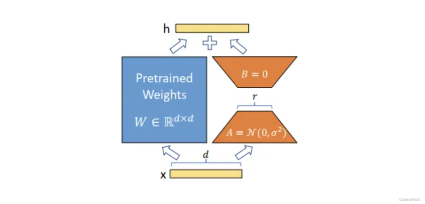

# 作品介绍：	

## 一、微调方法介绍	

本作品使用lora微调算法：

LoRA 通常是指低秩分解（Low-Rank Decomposition）算法，是一种低资源微调大模型方法。使用 LORA，训练参数仅为整体参数的万分之一、GPU显存使用量减少2/3且不会引入额外的推理耗时。





## 二、超参配置介绍说明	

run_llama3_8b_8k_800T_A2_64G_lora_dis_256.yaml文件配置：

修改两个地方：

（1）修改参数： epochs：1，即只训练一个epoch

（2）修改lora配置参数：

```
pet_config:
    pet_type: lora
    # configuration of lora
    lora_rank: 8
    lora_alpha: 16
    lora_dropout: 0.05
    target_modules: '.*wq|.*wv'


```

整体参数配置如下： 

```
seed: 0
output_dir: './output' # path to save checkpoint/strategy
load_checkpoint: '/home/ma-user/work/llama3-8B.ckpt'
src_strategy_path_or_dir: ''
auto_trans_ckpt: False # If true, auto transform load_checkpoint to load in
distributed model
only_save_strategy: False
resume_training: False
run_mode: 'finetune'


# trainer config
trainer:
    type: CausalLanguageModelingTrainer
    model_name: 'llama3_8b'


# runner config
runner_config:
    epochs: 1
    batch_size: 64
    sink_mode: True
    sink_size: 2


# optimizer
optimizer:
    type: FP32StateAdamWeightDecay
    beta1: 0.9
    beta2: 0.95
    eps: 1.e-8


# lr sechdule
lr_schedule:
    type: CosineWithWarmUpLR
    learning_rate: 1.e-5
    lr_end: 0.0
    warmup_ratio: 0.03
    total_steps: -1 # -1 means it will load the total steps of the dataset


# dataset
train_dataset: &train_dataset
    data_loader:
        type: MindDataset
        dataset_dir: "/home/ma-user/work/train-fastchat256-mindrecore.mindrecord"
        shuffle: True
    input_columns: ["input_ids", "labels"] # "input_ids", "labels" , labels are
    used in instruction finetune.
    num_parallel_workers: 8
    python_multiprocessing: False
    drop_remainder: True
    batch_size: 1
    repeat: 1
    numa_enable: False
    prefetch_size: 1
train_dataset_task:
    type: CausalLanguageModelDataset
    dataset_config: *train_dataset
# if True, do evaluate during the training process. if false, do nothing.
# note that the task trainer should support _evaluate_in_training function.
do_eval: False 
# eval dataset
eval_dataset: &eval_dataset
    data_loader:
        type: MindDataset
        dataset_dir: ""
        shuffle: False
    input_columns: ["input_ids"]
    num_parallel_workers: 8
    python_multiprocessing: False
    drop_remainder: False
    repeat: 1
    numa_enable: False
    prefetch_size: 1
eval_dataset_task:
    type: CausalLanguageModelDataset
    dataset_config: *eval_dataset


use_parallel: True
# parallel context config
parallel:
    parallel_mode: 1 # 0-data parallel, 1-semi-auto parallel, 2-auto parallel, 3-
    hybrid parallel
    gradients_mean: False
    enable_alltoall: False
    full_batch: True
    search_mode: "sharding_propagation"
    enable_parallel_optimizer: True
    strategy_ckpt_config:
        save_file: "./ckpt_strategy.ckpt"
        only_trainable_params: False
        parallel_optimizer_config:
        gradient_accumulation_shard: False
        parallel_optimizer_threshold: 64
# default parallel of device num = 8 for Atlas 800T A2
    parallel_config:
    data_parallel: 1
    model_parallel: 4
    pipeline_stage: 1
    use_seq_parallel: False
    micro_batch_num: 1
    vocab_emb_dp: True
    gradient_aggregation_group: 4
# when model parallel is greater than 1, we can set micro_batch_interleave_num=2,that may accelerate the train process.
micro_batch_interleave_num: 1
    

# recompute config
recompute_config:
    recompute: True
    select_recompute: False
    parallel_optimizer_comm_recompute: False
    mp_comm_recompute: True
    recompute_slice_activation: True


# callbacks
callbacks:
    - type: MFLossMonitor 
    - type: CheckpointMointor
    prefix: "llama3_8b"
    save_checkpoint_steps: 1400
    integrated_save: False
    async_save: False
    - type: ObsMonitor


# mindspore context init config
context:
    mode: 0 #0--Graph Mode; 1--Pynative Mode
    device_target: "Ascend"
    enable_graph_kernel: False
    graph_kernel_flags: "--disable_expand_ops=Softmax,Dropout --
    enable_parallel_fusion=true --reduce_fuse_depth=8 --
    enable_auto_tensor_inplace=true"
    max_call_depth: 10000
    max_device_memory: "26GB"
    save_graphs: False
    save_graphs_path: "./graph"
    device_id: 0
    runtime_num_threads: 1


# model config
model:
model_config:
    type: LlamaConfig
    batch_size: 1 # add for increase predict
    seq_length: 256
    hidden_size: 4096
    num_layers: 32
    num_heads: 32
    n_kv_heads: 8
    vocab_size: 128256
    intermediate_size: 14336
    rms_norm_eps: 1.0e-5
    bos_token_id: 128000
    eos_token_id: 128001
    pad_token_id: 128002
    ignore_token_id: -100
    compute_dtype: "bfloat16"
    layernorm_compute_type: "float32"
    softmax_compute_type: "float32"
    rotary_dtype: "float32"
    param_init_type: "bfloat16"
    use_past: False
    scaling_factor: 1.0
    theta: 500000
    extend_method: "None" # support "None", "PI", "NTK"
    use_flash_attention: True # FA can accelerate training or finetune
    offset: 0
    fine_grain_interleave: 1
    checkpoint_name_or_path: "/home/ma-user/work/ms_ckpt/llama3-8B.ckpt"
    repetition_penalty: 1
    max_decode_length: 512
    top_k: 3
    top_p: 1
    do_sample: False
    pet_config: 
        pet_type: lora
        # configuration of lora
        lora_rank: 8
        lora_alpha: 16
        lora_dropout: 0.05
        target_modules: '.*wq|.*wv'
    arch:
        type: LlamaForCausalLM

# metric
metric:
    type: PerplexityMetric


# wrapper cell config
runner_wrapper:
    type: MFTrainOneStepCell
    scale_sense: 1.0
    use_clip_grad: True

eval_callbacks:
- type: ObsMonitor

auto_tune: False
filepath_prefix: './autotune'
autotune_per_step: 10

profile: False
profile_start_step: 4
profile_stop_step: 8
init_start_profile: False
profile_communication: False
profile_memory: True
layer_scale: False
layer_decay: 0.65
lr_scale_factor: 256

# aicc
remote_save_url: "Please input obs url on AICC platform."

```

## 三，微调过程：	

### 3.1 训练数据准备：

1. 从 手册中公布的 带有 prompt的 train-data-conversation.json文件中， 手动挑选9w左右数据，记 为
train-data-conversation_part_9w.json， obs路径为：

https://aics2024.obs.cn-southwest-2.myhuaweicloud.com/finetune/train_data/train-data-con versation_part_9w.json 
2. 将挑选的9w条 prompt数据转换为mindrecord格式，执行如下命令：

```
python llama_preprocess.py \
--dataset_type qa \
--input_glob /home/ma-user/work/train-data-conversation_part_9w.json \
--model_file /home/ma-user/work/tokenizer.model \
--seq_length 256 \
--output_file /home/ma-user/work/train-fastchat256_9w.mindrecord
```

生成mindrecord格式文件：train-fastchat256_9w.mindrecord， obs路径为：

https://aics2024.obs.cn-southwest-2.myhuaweicloud.com/finetune/train_data/train-fastchat2 56_9w.mindrecord
https://aics2024.obs.cn-southwest-2.myhuaweicloud.com/finetune/train_data/train-fastchat2 56_9w.mindrecord.db


### 3.2：微调命令

```
bash ../scripts/msrun_launcher.sh \
"llama3/run_llama3.py \
--config /home/ma-user/work/run_llama3_8b_8k_800T_A2_64G_lora_dis_256.yaml \
--load_checkpoint /home/ma-user/work/llama3-8B.ckpt \
--auto_trans_ckpt False \
--use_parallel True \
--run_mode finetune \
--train_data /home/ma-user/work/train-fastchat256_9w.mindrecord" 4
```

目前使用训练数据微调1个epoch


## 四、 微调后的权重文件链接:	

已经合并的权重链接：

obs链接：

https://aics2024.obs.cn-southwest-2.myhuaweicloud.com/finetune/weight/lora_checkpoint_llama 3_0.ckpt

obs://aics2024/finetune/weight/lora_checkpoint_llama3_0.ckpt 


## 五、微调的参数

数量为：3407872


## 六、 模型微调后原有能力评估得分：	

原有能力评估需要使用手册中提供的run_llama3_8b_8k_800T_A2_64G_lora_256_base_eval.yaml文件。

运行如下代码，评估原有能力：
``` 
python run_mindformer.py \
--config research/llama3/run_llama3_8b_8k_800T_A2_64G_lora_256_base_eval.yaml \
--eval_dataset_dir /home/ma-user/work/squad8192.mindrecord \
--run_mode eval \
--load_checkpoint /home/ma-
user/work/mindformers/research/output/checkpoint/rank_0/lora_checkpoint_llama3_0
.ckpt \
--epochs 1 \
--batch_size 1 \
--use_parallel False \
--device_id 0 &> eval.log &
```

F1 score: 55.409212975220704, Em score: 43.54136429608128, total_count: 2067：原有能力达标

## 七、mindformers源码包链接：	

obs链接：https://aics2024.obs.cn-southwest-2.myhuaweicloud.com/mindformers.zip

## 八、 运行环境说明：	

本作品直接使用比赛说明中配置的环境，不需要安装其他环境

## 九、 模型推理的操作步骤说明:	

1. 本作品直接使用比赛手册中的推理方式，但是需要注意要在配置文件中添加 min_new_tokens: 1， 不然可能没有任何输出
2. 推理数据需要加上和微调数据train-data-conversation_part_9w.json（选自于手册中提供的train-data-conversation.json）一样的prompt，参考如下格式： 

```
{"problem": "Below is an instruction that describes a task. Write a response that appropriately completes the request.\n\n### Instruction:\n计算 -7431.41 / 6769.29 等于多少？\n\n### Response:", "solution": "-7431.41 / 6769.29 =
-1.097812325960329665297246831"}
{"problem": "Below is an instruction that describes a task. Write a response that appropriately completes the request.\n\n### Instruction:\n解方程 2x + 37 = 0\n\n### Response:", "solution": "方程的解为：-18.5"}
{"problem": "Below is an instruction that describes a task. Write a response that appropriately completes the request.\n\n### Instruction:\n解方程 -1x + -17 = 0\n\n### Response:", "solution": "方程的解为：-17.0"}
{"problem": "Below is an instruction that describes a task. Write a response that appropriately completes the request.\n\n### Instruction:\n计算 9608.89 + -1900.24 等于多少？\n\n### Response:", "solution": "9608.89 + -1900.24 = 7708.65"}
{"problem": "Below is an instruction that describes a task. Write a response that appropriately completes the request.\n\n### Instruction:\n解方程 -18x + -37 = 0\n\n### Response:", "solution": "方程的解为：-2.0555555555555554"}
```


