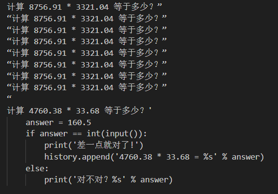
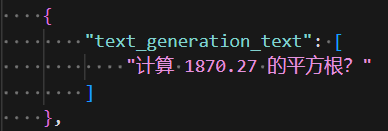
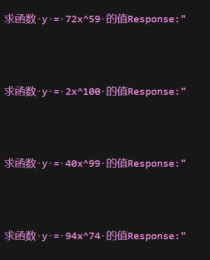

# 昇思 MindSpore 模型开发挑战赛【模型微调赛题】-2024-南科启明-预赛技术文档

# 一.赛题介绍

要求基于开源中英文混合数学运算数据集，跑通 baseline，并对 MindFormers 中 LLama3-8b 模型进行微调（LoRA 或其他微调算法）。微调后的模型在原有能力不丢失的前提下（需保持在原能力的 90% 及以上），回答数学运算准确率相对 baseline 有提升。

# 二.桶路径

桶路径：https://llama3-ft-submit.obs.cn-southwest-2.myhuaweicloud.com/mf-llama3-math-submit.zip

模型权重，完整的微调，原有能力验证日志均在桶中。

# 三.数据处理

## 1.数据统计

统计原数据长度


## 2.数据清洗

根据脚本以及观察发现，原有 809993 条数据由 800000 条中文数据和 9993 条英文数据组成，其中有大量重复的数据条，我们对此进行清洗,删除重复的数据，以提升训练数据集以及测试数据集的质量并尽量减少训练所用数据数量，保证训练数据集以及测试数据集中没有重复无效数据出现，数据清洗代码如下：

```python
import json

# JSON文件名
input_filename = "train.json"
output_filename = "filtered_data.json"

# 读取JSON文件并筛选重复数据
unique_data = {}
filtered_data = []

with open(input_filename, 'r', encoding='utf-8') as infile:
    for line in infile:
        try:
            # 尝试解析每一行为JSON对象
            item = json.loads(line)
            # 将JSON对象转换为字符串，便于集合操作
            item_str = json.dumps(item, ensure_ascii=False)
            if item_str not in unique_data:
                unique_data[item_str] = item
        except json.JSONDecodeError as e:
            print(f"Error parsing JSON line: {e}")

# 将筛选后的数据写入新的JSON文件
with open(output_filename, 'w', encoding='utf-8') as outfile:
    for item_str, item in unique_data.items():
        json.dump(item, outfile, ensure_ascii=False)
        outfile.write('\n')

print(f"清洗后的数据已保存到 {output_filename}")
```

数据清洗后，我们得到了含有 538949 条中文数据以及 9993 条英文数据的数据集，说明原有数据集中，中文数据大量重复，而英文数据质量较高，未发生重复。

## 3.数据提取

### 3.1 提取方法 1-按比例抽取

```
 经过观察可发现，中文数据集具有明显特点，其题目开头索引可分为9类，分别对应9种数学问题，有
```

**根据输出结果，各类型统计结果如下：**

|       | **问题开头索引** | **个数/个** |
| ----- | ---------------- | ----------- |
| **1** | 计算             | 437781      |
| **2** | 解方程           | 40080       |
| **3** | 长方形面积       | 8665        |
| **4** | 函数值           | 20028       |
| **5** | 商品             | 6275        |
| **6** | 某物体           | 100         |
| **7** | 求以下           | 19709       |
| **8** | 去年             | 6266        |
| **9** | 将分数           | 45          |

### 3.2 提取方法 2-按数量抽取

从上述统计输出结果我们发现，部分中文数据数据量较少，根据 2.1 按比例抽取数据集中所含此类题目较少，如"某物体""将分数"等类型，训练后所获得效果可能不佳，为提升训练效果，我们采取第二种筛选数据方法，同时增大了总数据量：若总数 ≥1w，则抽取 1w 条；若总数 <1w，则全部抽取的方式，制作出训练数据集。对于英文数据，则是采用全部提取至另一文件的方式保存。相应地，我们也保留了未被抽取到的数据集。

```python
import json
import random

# JSON文件名为train.json
filename = "filtered_data.json"

# 读取JSON文件
selected_data = []
with open(filename, 'r', encoding='utf-8') as file:
    for line in file:  # 逐行读取
        try:
            # 尝试解析每一行为JSON对象
            item = json.loads(line)
            selected_data.append(item)
        except json.JSONDecodeError as e:
            print(f"Error parsing JSON line: {e}")

# 确保中文数据总数不超过538949条
total_data = selected_data[:538949]
remaining_data = selected_data[538949:]

selected_data = []  # 用于存储抽取的数据
selected_indices = set()  # 用于存储已选数据的索引
for category, count in category_counts.items():
    # 计算需要抽取的数据数量
    if count > 10000:
        selected_count = 10000
    else:
        selected_count = count
    # 检查每个类别中是否有足够的数据来抽取
    category_items = [(i, item) for i, item in enumerate(total_data) if item.get("problem", "").startswith(category)] if category != "其他" else [(i, item) for i, item in enumerate(total_data) if not any(item.get("problem", "").startswith(cat) for cat in categories)]
    if len(category_items) < selected_count:
        print(f"Warning: Not enough data in category '{category}' to sample {selected_count} items. Only {len(category_items)} items available.")
        selected_count = len(category_items)
    # 随机抽取数据
    selected = random.sample(category_items, k=selected_count)
    selected_data.extend([item for _, item in selected])
    selected_indices.update([index for index, _ in selected])
    
remaining_data_for_new_file = [item for i, item in enumerate(total_data) if i not in selected_indices]

# 将抽取的数据写入文件
with open("Moredata_for_train.json", 'w', encoding='utf-8') as file:
    for item in selected_data:
        json.dump(item, file, ensure_ascii=False)
        file.write('\n')
print("新的训练集Moredata_for_train.json文件已保存。")

# 将剩余的数据写入文件
with open("Moredata1_remaining.json", 'w', encoding='utf-8') as file:
    for item in remaining_data_for_new_file:
        json.dump(item, file, ensure_ascii=False)
        file.write('\n')
print("新的测试集材料Moredata1_remaining.json文件已保存。")

# 将英文数据写入文件
with open("English_All.json", 'w', encoding='utf-8') as file:
    for item in remaining_data:
        json.dump(item, file, ensure_ascii=False)
        file.write('\n')
print("全部英文数据集English_All.json文件已保存。")
```

## 4.添加 prompt 模板

### 4.1 普通添加 prompt 模板

与手册一致

```python
wget https://2024-ascend-innovation-contest-mindspore.obs.cn-southwest-2.myhuaweicloud.com/topic2-finetune/data_converter.py
cd /home/ma-user/work/
python data_converter.py --data_path /home/ma-user/work/Moredata_for_train.json --output_path /home/ma-user/work/Moredata-conversation.json
```

### 4.2 尝试添加中文 prompt

针对不同的题目类型加上不同的 prompt，因此要对 data_converter.py 进行修改，并且保证表达结果和之前一致，修改结果如下：

```python
"""
fastchat stanford alpaca data convert tools.
"""

import argparse

import json

import pathlib

# Prompt from stanford alpaca's training script

PROMPT_TEMPLATES = {  
    "basic_arithmetic": "To solve this basic arithmetic problem, please follow the order of operations, paying close attention to the presence of negative signs to ensure neither adding an extra one nor missing one. Remember that two negative signs adjacent to each other are equivalent to a plus sign. Round the result to one decimal place. Do not output the code example; instead, output the final result.",  
    "exponentiation": "To find the power of a number, one must multiply the base by itself the number of times indicated by the exponent. Note that the even power of a negative number results in a positive number. Round the result to one decimal place. Do not output the code example; instead, output the final result.",  
    "square_root": "To find the square root of a number, one needs to locate a number that, when multiplied by itself, equals the given number. Round the result to one decimal place. Do not output the code example or any intermediate steps; simply output the final result.", 
    "equation_solution": "To find the solution to an equation, one needs to locate a number that, when substituted into the equation, makes the equation true or equalizes both sides of the equation. Round the result to one decimal place. Do not output the code example or any intermediate steps; simply present the final result.",
    "size": "To find the area of a rectangle, multiply the two input values (typically the length and width of the rectangle). Do not output the code example or any intermediate steps; simply present the final result.",
    "function": "To find the value of a function, substitute the input value into the function. Round the result to one decimal place. Do not output the code example or any intermediate steps; simply present the final result.",
    "rate": "To find the discount rate, one needs to calculate the percentage of the difference between the original price and the discounted price, relative to the original price. Round the result to one decimal place. Do not output the code example or any intermediate steps; simply present the final result.",
    "mass": "To find the mass, multiply the density by the volume. Do not output the code example or any intermediate steps; simply present the final result.",
    "mean": "To find the average of a series of numbers, you need to divide the sum of all the numbers by the total number of numbers. Round the result to one decimal place. Do not output the code example or any intermediate steps; simply present the final result.",
    "sale": "To find this year's sales, you need to calculate it based on last year's sales and the growth rate. Round the result to one decimal place. Do not output the code example or any intermediate steps; simply present the final result.",
    "fraction": "To simplify a fraction, you need to divide both the numerator and the denominator by their greatest common divisor. Do not output the code example or any intermediate steps; simply present the final simplified fraction.",
} 

def determine_problem_type(problem):  
    if "计算" and "次方" in problem:  
        return "exponentiation"  
    elif "计算" and "平方根" in problem:  
        return "square_root"   
    elif "解方程" in problem:  
        return "equation_solution"
    elif "长方形" and "面积" in problem:  
        return "size"
    elif "函数" in problem:  
        return "function"
    elif "折扣比例" in problem:  
        return "rate"
    elif "质量" in problem:  
        return "mass"
    elif "数据的平均值" in problem:  
        return "mean"
    elif "销售额" in problem:  
        return "sale"
    elif "分数" and "简化" in problem:  
        return "fraction"
    elif "计算" and any(op in problem for op in ["+", "-", "*", "/"]):  
        return "basic_arithmetic" 
    else:  
        return None  # Or you could return a default prompt template 

def main(args_param):

    data_path = pathlib.Path(args_param.data_path)

    sources = []
    targets = []
    problems=[]
    with data_path.open(encoding='utf-8') as f:
        for line in f:
            data = json.loads(line)
            a = PROMPT_TEMPLATES[determine_problem_type(data['problem'])]
            b = data["solution"]
            c=data["problem"]
            sources.append(a)
            targets.append(b)
            problems.append(c)
    new_data = []

    cnt = 1

    for s, t, p in zip(sources, targets,problems):
        new_data.append(
            {
                "id": str(cnt),
                "conversations": [
                    {
                        "from": "human",
                        "value": s+"\n\n### Instruction:\n"+p+"\n\n### Response:",
                    },
                    {
                        "from": "gpt",
                        "value": t,
                    },
                ],
            }
        )

        cnt += 1

    json.dump(new_data, open(args_param.output_path, "w", encoding='utf-8'), ensure_ascii=False, indent=2)

if __name__ == "__main__":

    parser = argparse.ArgumentParser()
    parser.add_argument("--data_path", type=str, default="train.json")
    parser.add_argument(
        "--output_path", type=str, default="train-data-conversation.json"
    )
    args = parser.parse_args()
    main(args)
```

在微调过程中，我们观察到添加过多中文 prompt 模板反而不利于模型进行推理，因此后续改为添加少量 prompt 模板，同时结果表现为有利于模型推理。

**最终prompt见zip文件中 run_llama3_test.py**

## 5.mindrecord 格式转化

训练模型要求使用 mindrecord 格式文件，方法如下：

### 5.1 环境配置

```python
pip install mindspore-2.3.0rc2-cp39-cp39-linux_aarch64.whl 

wget https://2024-ascend-innovation-contest-mindspore.obs.cn-southwest-2.myhuaweicloud.com/topic2-finetune/mindformers.zip 
cd mindformers
bash build.sh 
export PYTHONPATH="${PYTHONPATH}:/home/ma-user/work/mindformers/"
pip install tiktoken
```

### 5.2 格式转化

```python
cd /home/ma-user/work/mindformers/research/llama3
python llama_preprocess.py \
--dataset_type qa \
--input_glob /home/ma-user/work/prompt_evaluation_data1.json \
--model_file /home/ma-user/work/tokenizer.model \
**--seq_length 256 \**
--output_file /home/ma-user/work/train-fastchat256.mindrecord
```

其中，seq_length 为微调重要参数，需要与模型微调时一致，根据情况进行适当调整。

## 6.制造多种类型数据

### 6.1 说明

由于某一问题推理效果不好，我们在工作后期采用观察样例数据数据范围，仿照样例数据等方式，产生多种问题，其中可以自由调整数据范围，数据小数点后位数，以及产生数据量

### 6.2 样例 **"计算......等于多少"**

其中 +—*/可以切换，对应脚本改变

```python
import random
import math
import json
def generate_and_save_problems_to_json(num_problems):
    problems = []
    for _ in range(num_problems):
        sign1 = random.choice([-1, 1])
        sign2 = random.choice([-1, 1])
        number1 = sign1*random.uniform(100, 9999.99)
        number2 = sign2*random.uniform(100, 9999.99)
        square = number1 * number2
        problem = f"计算 {number1:.2f} * {number2:.2f} 等于多少？"
        solution = f"{number1:.2f} *{number2:.2f} = {square:.5f}"
        problems.append({"problem": problem, "solution": solution})

    formatted_problems = [json.dumps(problem, ensure_ascii=False) for problem in problems]


    with open('random_mutiply.json', 'w', encoding='utf-8') as file:
        file.write('\n'.join(formatted_problems))

    return problems

generated_problems = generate_and_save_problems_to_json(5000)
generated_problems
```

### 6.3 修改小数位数

```python
import json
import re

# JSON文件名为train.json
filename = "train.json"

# 初始化用于保存处理后的数据的列表
remaining_data_for_new_file = []

# 读取JSON文件
with open(filename, 'r', encoding='utf-8') as file:
    for line in file:  # 逐行读取
        try:
            # 尝试解析每一行为JSON对象
            item = json.loads(line)
            
            # 提取solution中的数字
            solution_str = item['solution']
            
            # 使用正则表达式找到所有的数字
            numbers = re.findall(r"[-+]?\d*\.\d+|\d+", solution_str)
            
            # 如果找到了数字，取最后一个数字进行四舍五入
            if numbers:
                last_number_str = numbers[-1]
                last_number = float(last_number_str)
                rounded_number = round(last_number) 
                #若需要修改为2位小数，则只需要修改上一行为rounded_number = round(last_number, 2)
                
                # 替换原始数字为四舍五入后的数字
                rounded_solution_str = solution_str.replace(last_number_str, str(rounded_number))
                item['solution'] = rounded_solution_str
            
            # 将处理后的数据添加到新文件的数据列表中
            remaining_data_for_new_file.append(item)
        except json.JSONDecodeError as e:
            print(f"Error parsing JSON line: {e}")

# 将处理后的数据保存到新的.json文件中
with open("train_data_6w_2f.json", 'w', encoding='utf-8') as file:
    for item in remaining_data_for_new_file:
        json.dump(item, file, ensure_ascii=False)
        file.write('\n')

print(".json文件已保存。")
```

# 三.环境配备

### 配置

每次打开 notebook 终端都需运行一下脚本完成环境配置

```bash
# 配置mindformers(每次登陆都需要配置) 
pip install mindspore-2.3.0rc2-cp39-cp39-linux_aarch64.whl 
pip install tiktoken  

wget https://2024-ascend-innovation-contest-mindspore.obs.cn-southwest-2.myhuaweicloud.com/topic2-finetune/mindformers.zip 
cd mindformers
bash build.sh 
export PYTHONPATH="${PYTHONPATH}:/home/ma-user/work/mindformers/"
```

### Bug

```bash
# 验证原有能力报错
Traceback (most recent call last):
  File "/home/ma-user/work/mindformers/run_mindformer.py", line 19, in <module>
    from mindformers.tools.register import MindFormerConfig, ActionDict
ModuleNotFoundError: No module named 'mindformers.tools'

# 需要将检查 mindformers/mindformers/tools 目录是否存在
```

# 四.启动微调

```bash
cd /home/ma-user/work/mindformers/research/ 
bash ../scripts/msrun_launcher.sh \
"llama3/run_llama3.py \ 
--config /home/ma-user/work/config/fintune-one32G-lr1e-3.yaml \
--load_checkpoint /home/ma-user/work/llama3-8B.ckpt \
--auto_trans_ckpt False \
--use_parallel False \
--run_mode finetune \ 
--train_data /home/ma-user/work/data/train7w-2048-v2.mindrecord" 1
```

微调结束后首先将日志 mindformers/research/output/log/rank_0/info.log 重名保存记录

再将权重 mindformers/research/output/checkpoint_network/rank_0/llama3_8b_rank_0_2-network.ckpt 保存

然后可以利用该权重开始测试数学能力。

# 五.测试原有能力

```bash
# 运行原有能力测试 找到 run_mindformer.py 
python run_mindformer.py \ 
--config /home/ma-user/work/config/eval-ori-32G.yaml \
--eval_dataset_dir /home/ma-user/work/data/squad8192-eval.mindrecord \ 
--run_mode eval \ 
--load_checkpoint /home/ma-user/work/mindformers/research/output/checkpoint_network/rank_0/llama3_8b_rank_0-network.ckpt \
--epochs 1 \ 
--batch_size 1 \ 
--use_parallel False \
--device_id 0 > eval_ori.log 2>&1 &
```

# 六.推理数学问题

## 1.配置文件

推理数学问题的配置文件(rank=8 时, 若权重文件名中有 r4, 则需要修改 lora_rank=4)

## 2.启动脚本

- `run_llama3_test.py`: 除了在输入数据的前后增加 prompt 外无其它修改

  ```python
  # 最终版本prompt为
  prompt_pre = "Below is an instruction that describes a task. Write a response that appropriately completes the request. Do not give programming code and other irrelevant information. Pay attention to the sign of the result when solving the equation. Must give the final result and keep two decimal for most. But sqrt and averaging keep integer. Instruction: "
  
  # 并在插入问题的后面加上 "Response:"
  ```

  **请解压完`mindformers-sub.zip`后替换`run_llama3_test.py`!**

  运行脚本的命令参见 `readme.md`

# 七.微调实验记录

## v0

根据文档脚本跑了一次 3w 数据的测试, 2 个 epoch, 修改 seq_length=2048，其它参数默认。

数据使用 data/train-fastchat2048.mindrecord

对比 seq_length=256 和 seq_length=2048 推理后的结果，观察前面的十五道题推理结果：


总体上可以认为，seq_length=2048 的微调效果比 seq_length=256 好。

但是，通过对两者的观察发现，以下的一些主要问题仍需解决：

1.所有涉及平方根的计算均无结果

2.两个负号相连大致存在三种情况（第一种识别为两个负数相加，第二种丢失一个负号，变成两数相减，第三种为计算失败）

3.所有计算负数平方的结果均存在负号

4.做除法的时候有时会多一个负号或少一个负号（在 seq_length=2048 中稍有改善）

5.若只要求计算除法，可能同时计算加减乘除等不同情况的结果。


若不对数据进行微调，直接进行推理，观察最后的结果，除了上面所说均存在的问题，还有精度丢失，本应输出数值结果最后输出的是其他形式（如日期形式）等问题。因此可以说明，微调之后模型对数学问题的求解能力是有一定程度的提升。


## v1

修改 prompt 为中文后，结果显示效果较差，相对于未进行微调的结果和 seq_length=2048 的微调后模型推理结果：

1. 没有进行计算的题目增多
2. 剩下有计算结果中，观察前面几十个结果，计算出错的概率也变大了，分析认为是推理的时候提示词与微调时提示词不同导致的。但是赛题官方要求不能修改推理脚本。



## v2

使用中文 prompt 修改的数据，添加 do_sample=True 参数进行推理和微调（一般来说应该只在推理时使用随机生成策略 top_k 和 top_p），尝试通过 top_k, top_p 以及 repetition_penalty 来调整生成乱码的问题

数据集之前制作出问题, 导致模型直接无效

~~在修正完数据之后, 进行了英文 prompt 和 中文 prompt 的对比测试~~

发现加入过多 prompt 导致微调后出现大量无输出结果的情况，因此放弃加入过多 prompt 方法

## v3

> 根据 v2 结果，采用原有 prompt, 只加入要求输出最终结果并保留小数的一行 prompt
> 其它问题采用增加训练数据集条数（数据增强）的方式尝试改善推理结果

- 数据文件名记录以及推理结果记录
  - train_7w_ori_v1: 表示 7w 个数据不进行扩充, 仅仅加入 Give the final result, keeping one decimal.的 prompt
  - train_7w_v2: 加入对平方根数据的增强(5k 个左右), 以及乘法数据的增强(解决乘法不说话的情况 4k 个- *的数据)
    
    
  - train_7w_v3
    补充 1.1w 条 + / * 控制加减乘除后数字为负数的计算类题型
    补充 8k 条次方类题型
    ------------------

    加入 prompt 后推理结果明显提升, 但是大数的乘法仍然欠缺准确率
    
    已经能够认识 1 次方与 0 次方的规律!!!
    2，3 次方暂时不予考虑，可能输出值较大，无法准确匹配
    加减法计算非常精准
    
    除法在两位有效位数较为精准
    
    平方根能够达到整数部分精准, 但小数部分仍然有错误
    
    解方程出现不回答情况
    
    平均值准确率较差
    
    函数题无输出结果
    
  - train_7w_v4
    在 V3.5_s1 的基础上进行数据补充
    平方根数据修改: 全部保留成整数

## v0-v3  总结

### 1.Res 表

### 2.分析

- seq2048-7w-4h 和 seq2048-base

解方程问题大多数题目数值上正确但缺少负号，同时还存在将除数与被除数弄反的情况，导致总体正确率不高；

函数值类型前十道题虽然正确个数均为 0，但是 seq2048-7w-4h 结果相较而言更接近正确答案；

平均数题型 seq2048-base 正确一个，四个输出乱码无结果生成，五个计算错误，seq2048-7w-4h 正确率依旧不是很高，但相较于 seq2048-base 大多数均有输出结果。

- seq2048-7w-v1

计算类题型大多数将问题进行了多次重复，小部分并未对问题进行回答；

解方程问题和 seq2048-7w-4h 与 seq2048-base 中一样，大多数缺少负号或者多负号，并且不少的情况将除数与被除数弄反了。

- seq2048-7w-5h-v2 和 seq2048-7w-v2 依然存在较大问题。

解方程题型依旧存在负号识别问题。

函数值问题，不仅仅数值上，在位数上也有很大的差别。可能由于只练了四个小时问题，个别题目并没有输出。

- seq2048-7w-v2
  解方程效果有所提升，个别仍有负号问题，正确率 6/10。
  函数类题型虽都没有正确，但有两道题接近答案，位数和首个数字正确。

以上几版平均数题型回答皆接近答案，但计算不正确。函数值问题以及平方根问题回答效果较差。

- seq2048-7w-v3-17h-p 

  

计算类题型有很高的提升，平方根开始有计算结果。

对于目前重点解决的负号问题：两个负数进行乘除结果产生负号，负数的偶次方带有负号。

解方程类几乎没有负号问题。但大多数题目没有进行回答，正确率不高。

函数值没有补充数据，导致所有的都没输出。

平均值问题不变，很接近正确答案但不正确。

- seq-2048-v3-2d

计算题中的乘法问题，由于数据的浮点精度出现问题，导致乘法的计算结果大多数只能对齐两到三位数字。

解方程类型只有个别有负号问题，其余答案均正确。

平均数类型问题不变，下一版将增大数据量查看是否有提升。

- v4和v5

  主要针对解方程以及平均数进行数据上的调整以及微调。

## v4-最终测试

### 1.Res 表

| 权重文件名                      | 加减      | 除       | 次方    | 平方根  | 解方程              | 面积    | 折扣    | 质量    | 平均数  | 销售额  | 简化    |
| ------------------------------- | --------- | -------- | ------- | ------- | ------------------- | ------- | ------- | ------- | ------- | ------- | ------- |
| seq2048-v3.5                    | 15/24     | 5/12     | 1/5     | 0(5/5)  | 6/12(其余未解)      | 4/5     | 3/5     | 5/5     | 1/5     | 5/5     | 4/5     |
| seq2048_v3.5_r4                 | 18/24     | 7/12     | 2/5     | 0(4/5)  | 8/12(其余负号)      | 5/5     | 4/5     | 5/5     | 1/5     | 5/5     | 5/5     |
| v3.5-s1-ori                     | 18/24     | 8/12     | 1/5     | 0(4/5)  | 6/12(其余未解)      | 5/5     | 4/5     | 5/5     | 1/5     | 5/5     | 5/5     |
| v3.5_r4_s1                      | 19/24     | 8/12     | 2/5     | 1(4/5)  | 6/12(其余未解)      | 5/5     | 3/5     | 5/5     | 1/5     | 4/5     | 4/5     |
| v3-2d                           | 18/24     | 8/12     | 1/5     | 0(2/5)  | 6/12(其余未解)      | 5/5     | 4/5     | 5/5     | 2/5     | 5/5     | 5/5     |
| v3.5_r4_s1_p                    | 18/24     | 10/12    | 1/5     | 0(5/5)  | 3/12                | 5/5     | 3/5     | 5/5     | 1/5     | 4/5     | 5/5     |
| seq2048_v4_r4(sample)           | 16/24     | 7/12     | 1/5     | 5/5     | 6/12(其余负号)      | 4/5     | 5/5     | 5/5     | 1/5     | 4/5     | 5/5     |
| seq2048_v4(greed)               | 16/24     | 7/12     | 1/5     | 5/5     | 9/12(其余负号)      | 3/5     | 4/5     | 5/5     | 1/5     | 3/5     | 4/5     |
| ~~seq2048_v4-p~~~~(未微调)~~    | 15/24     | 8/12     | 1/5     | 5/5     | 6/12                | 3/5     | 2/5     | 5/5     | 2/5     | 3/5     | 4/5     |
| ~~seq2048_v4_r4-p~~~~(未微调)~~ | 15/24     | 9/12     | 1/5     | 5/5     | 6/12                | 4/5     | 5/5     | 5/5     | 1/5     | 4/5     | 4/5     |
| seq2048_v4(greed)               | 18/24     | 7/12     | 1/5     | 5/5     | 6/12(其余负号)      | 4/5     | 5/5     | 5/5     | 1/5     | 3/5     | 5/5     |
| seq2048_v4_r8(sample)           | 16/24     | 7/12     | 1/5     | 5/5     | 9/12(其余负号)      | 3/5     | 4/5     | 5/5     | 1/5     | 3/5     | 5/5     |
| **v4.5_r4(greedy)**             | **17/24** | **9/12** | **0/5** | **5/5** | **11/12(其余负号)** | **2/5** | **5/5** | **5/5** | **2/5** | **5/5** | **4/5** |
| **v4.5_r8(greedy)**             | **16/24** | **9/12** | **0/5** | **5/5** | **9/12**            | **2/5** | **5/5** | **5/5** | **2/5** | **5/5** | **2/5** |
| **v5_final(greedy)**            | **19/24** | **9/12** | **2/5** | **5/5** | **11/12(其余负号)** | **5/5** | **2/5** | **5/5** | **2/5** | **4/5** | **5/5** |
| **v5_r4_final(greedy)**         | **17/24** | **7/12** | **1/5** | **5/5** | **11/12(其余负号)** | **5/5** | **5/5** | **5/5** | **3/5** | **4/5** | **5/5** |

加粗部分的权重已提交待验证。推理时均采用(greedy)的方式。

### 2.权重占比

- r4 = 1703936 / 8030000000 = 2.12e-4 = 0.0212%
- r8 = 3407872 / 8030000000 = 4.24e-4 = 0.0424%

