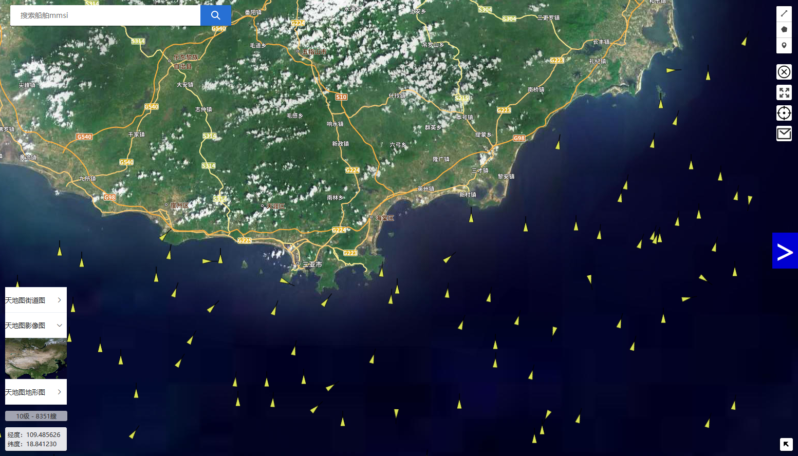
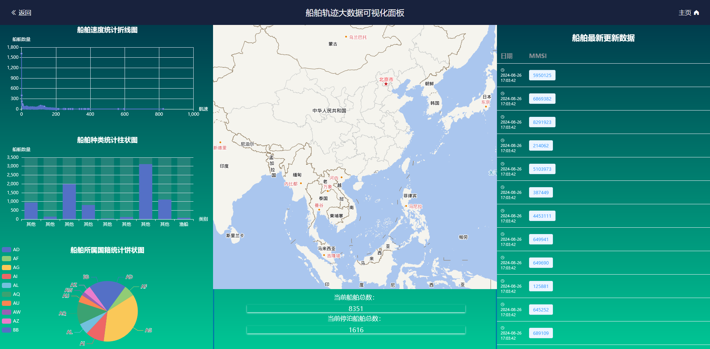

# 目录

- [1. ShipWiseNet 描述](#1-shipwisenet-描述)
- [2. 模型架构](#2-模型架构)
- [3. 数据集](#3-数据集)
    - [3.1 预训练数据集](#31-预训练数据集)
    - [3.2 项目任务数据集](#32-项目任务数据集)
    - [3.3 数据处理](#33-数据处理)
- [4. 快速使用](#4-快速使用)
    - [4.1 模型训练](#41-模型训练)
    - [4.2 模型推理](#42-模型推理)
- [5. 脚本说明](#5-脚本说明)
    - [5.1 脚本及样例代码](#51-脚本及样例代码)
    - [5.2 脚本参数](#52-脚本参数)
- [6. 模型说明](#6-模型说明)
    - [6.1 评估性能](#61-评估性能)
    - [6.2 推理性能](#62-推理性能)
- [7. 项目展示](#7-项目展示)

# 1. ShipWiseNet 描述

ShipWiseNet
是一个高效、轻量级的目标检测网络，专门设计用于检测海上船只和航行目标，适应复杂的海洋环境和实时需求。该模型基于先进的深度学习架构，结合特定的优化技术，实现了在高精度和低计算资源需求间的平衡，适用于嵌入式设备和无人系统等资源受限的场景。ShipWiseNet
提供了卓越的检测速度和鲁棒性，即使在天气恶劣、光照变化大或背景复杂的情况下，依旧能准确识别和定位船只目标。

# 2. 模型架构

ShipWiseNet 的架构设计聚焦于海上目标检测的特定需求。模型由特征提取、检测头、以及优化模块组成，以实现对船只的精准识别和高效检测：

1. 特征提取模块：采用多层卷积神经网络（CNN）构建的特征提取层，经过优化以捕获船只的边缘特征和形态细节，确保在复杂背景中提取有效信息。该模块能够在多尺度上进行特征表达，增强了模型的适应性。
2. 检测头：在检测层中，ShipWiseNet 使用了基于自适应锚框的检测策略，使其能够灵活应对不同尺寸、不同距离的目标。检测头采用了轻量级设计，进一步降低了计算复杂度。
3. 优化模块：通过引入特定的正则化和损失函数优化策略，ShipWiseNet
   可以在保持检测精度的同时减少模型体积。此外，该模块还包含了精细化的背景抑制技术，能够有效过滤无关信息，从而提升海上复杂场景中的鲁棒性。

该架构使 ShipWiseNet 能够在低算力设备上流畅运行，同时保持高精度检测能力，非常适合海洋环境中的实时船只检测需求。

# 3. 数据集

## 3.1 预训练数据集

COCO 2017 数据集 是一个广泛用于目标检测、分割和关键点检测的通用大型数据集，包含了多样化的场景和对象类别。COCO 2017
拥有超过20万张图像，涵盖了80类物体，为 ShipWiseNet 提供了丰富的预训练数据，使其具备较强的目标检测基础能力。

- 数据集规模：COCO 2017 数据集包括约118,000张训练图像和5,000张验证图像，图像内容涵盖了大量自然场景，帮助模型在预训练阶段学到丰富的特征表达。
- 物体多样性：数据集中的物体种类和姿态多样，为 ShipWiseNet 模型在进行船只检测前提供了广泛的视觉先验知识，提升了模型的泛化能力。
- 标注信息：COCO 2017 提供了精准的标注信息，支持边界框和分割等多种检测任务，使得模型能够在多尺度、多姿态下的检测任务中保持稳健的性能。

通过在 COCO 2017 数据集上进行预训练，ShipWiseNet 的基础特征提取能力得到强化，有助于其在 HRSC2016
等专用数据集上进行微调时，更快适应海上目标检测的需求。

## 3.2 项目任务数据集

HRSC2016 数据集 是一个专门用于船只检测的高分辨率遥感图像数据集，广泛应用于海上目标检测和识别任务。该数据集包含了多种尺度、角度、姿态的船只目标，能够很好地模拟实际海上场景的复杂性，是训练和评估
ShipWiseNet 模型的理想选择。

1. 数据集规模：HRSC2016 包含1000余张高分辨率图像，涵盖了船只的多种类型和复杂背景，适合用于提升模型在各种海洋环境中的适应能力。
2. 图像特征：数据集中的图像具有丰富的细节，且角度多变，从不同视角展现了船只的形态特征，有助于模型在不同俯仰角和复杂背景下准确检测。
3. 标注信息：每张图像都提供了精确的船只位置标注，包括船只的轮廓和姿态信息，适用于旋转框标注格式，支持模型在多角度下的检测能力。

利用 HRSC2016 数据集，ShipWiseNet 能够学习到海上船只的多种视觉特征，提升对复杂背景和船只多样性的适应性。这使得 ShipWiseNet
在实际海上环境中具有更强的泛化能力和鲁棒性。

## 3.3 数据处理

在使用数据集前，需要对数据进行预处理，以适应模型的输入要求。数据处理主要包括图像读取、数据增强、标注解析等步骤：

```python
def xml_to_txt(xml_file_dir, txt_file_dir):
    os.makedirs(txt_file_dir, exist_ok=True)
    all_class_ids = set()
    for xml_file in os.listdir(xml_file_dir):
        if not xml_file.endswith('.xml') or xml_file == 'annotation_fmt.xml':
            continue
        xml_file_path = os.path.join(xml_file_dir, xml_file)
        tree = ET.parse(xml_file_path)
        root = tree.getroot()
        img_id = root.find('Img_ID').text
        img_width = int(root.find('Img_SizeWidth').text)
        img_height = int(root.find('Img_SizeHeight').text)
        txt_file_path = os.path.join(txt_file_dir, f"{img_id}.txt")
        objs = root.findall('.//HRSC_Object')
        if len(objs) == 0:
            continue
        with open(txt_file_path, 'w') as txt_file:
            for obj in objs:
                class_id = convert_cls_id(obj.find('Class_ID').text)
                all_class_ids.add(class_id)
                box_xmin = int(obj.find('box_xmin').text)
                box_ymin = int(obj.find('box_ymin').text)
                box_xmax = int(obj.find('box_xmax').text)
                box_ymax = int(obj.find('box_ymax').text)
                x_center = ((box_xmin + box_xmax) / 2) / img_width
                y_center = ((box_ymin + box_ymax) / 2) / img_height
                box_width = (box_xmax - box_xmin) / img_width
                box_height = (box_ymax - box_ymin) / img_height
                txt_file.write(f"{class_id} {x_center} {y_center} {box_width} {box_height}\n")
    print(f"Total class ids: {len(all_class_ids)}")
    print([str(class_id) for class_id in all_class_ids])
```

# 4. 快速使用

首先需要安装相关依赖项，安装MindSpore，你可以通过遵循[官方指引](https://www.mindspore.cn/install)，在不同的硬件平台上获得最优的安装体验。

本项目基于 MindYOLO 开发，MindYOLO 仓下载到本地后，将 `mindyolo/models/shipwise.py` 放到 MindYOLO 仓相应文件夹下。再在 `mindyolo/models/__init__.py` 中注册模型：

```python
from . import shipwise
__all__.extend(shipwise.__all__)
from .shipwise import *
```

您可以按照如下步骤进行训练和评估：

## 4.1 模型训练

```bash
# 训练模型
python train.py --config ./workspace/configs/ship-wise/ship-wise-s.yaml --log_interval 52
```

```txt
2024-09-16 17:20:40,329 [INFO] Epoch 146/500, Step 52/422, imgsize (640, 640), loss: 3.8198, lbox: 0.7182, lcls: 1.4714, dfl: 1.6302, cur_lr: 0.007129000034183264
2024-09-16 17:20:40,329 [INFO] Epoch 146/500, Step 52/422, step time: 993.04 ms
2024-09-16 17:21:31,956 [INFO] Epoch 146/500, Step 104/422, imgsize (640, 640), loss: 4.2556, lbox: 1.0156, lcls: 1.9761, dfl: 1.2639, cur_lr: 0.007129000034183264
2024-09-16 17:21:31,957 [INFO] Epoch 146/500, Step 104/422, step time: 992.82 ms
2024-09-16 17:22:23,579 [INFO] Epoch 146/500, Step 156/422, imgsize (640, 640), loss: 3.3041, lbox: 0.7597, lcls: 1.2315, dfl: 1.3129, cur_lr: 0.007129000034183264
2024-09-16 17:22:23,579 [INFO] Epoch 146/500, Step 156/422, step time: 992.73 ms
2024-09-16 17:23:15,262 [INFO] Epoch 146/500, Step 208/422, imgsize (640, 640), loss: 3.7350, lbox: 0.8932, lcls: 1.7161, dfl: 1.1257, cur_lr: 0.007129000034183264
2024-09-16 17:23:15,263 [INFO] Epoch 146/500, Step 208/422, step time: 993.93 ms
2024-09-16 17:24:06,943 [INFO] Epoch 146/500, Step 260/422, imgsize (640, 640), loss: 3.1018, lbox: 0.7251, lcls: 1.1993, dfl: 1.1774, cur_lr: 0.007129000034183264
2024-09-16 17:24:06,944 [INFO] Epoch 146/500, Step 260/422, step time: 993.86 ms
2024-09-16 17:24:58,402 [INFO] Epoch 146/500, Step 312/422, imgsize (640, 640), loss: 3.4070, lbox: 0.8956, lcls: 1.3462, dfl: 1.1653, cur_lr: 0.007129000034183264
2024-09-16 17:24:58,403 [INFO] Epoch 146/500, Step 312/422, step time: 989.59 ms
2024-09-16 17:25:49,862 [INFO] Epoch 146/500, Step 364/422, imgsize (640, 640), loss: 2.2349, lbox: 0.5543, lcls: 0.7309, dfl: 0.9497, cur_lr: 0.007129000034183264
2024-09-16 17:25:49,863 [INFO] Epoch 146/500, Step 364/422, step time: 989.62 ms
2024-09-16 17:26:41,257 [INFO] Epoch 146/500, Step 416/422, imgsize (640, 640), loss: 2.7312, lbox: 0.5390, lcls: 1.0165, dfl: 1.1757, cur_lr: 0.007129000034183264
2024-09-16 17:26:41,258 [INFO] Epoch 146/500, Step 416/422, step time: 988.38 ms
2024-09-16 17:26:47,405 [INFO] Saving model to ./runs\2024.09.15-22.56.30\weights\ship-wise-s-146_422.ckpt
2024-09-16 17:26:47,405 [INFO] Epoch 146/500, epoch time: 6.98 min.
```

## 4.2 模型推理

```bash
python predict.py --config=./workspace/configs/ship-wise/ship-wise-s.yaml --weight=./runs/2024.09.15-22.56.30/weights/ship-wise-s-153_422.ckpt --image_path=H:\Library\Datasets\HRSC\HRSC2016_dataset\HRSC2016\FullDataSet-YOLO-Split\test\100000630.bmp
```

```txt
2024-09-16 18:33:22,989 [INFO] number of network params, total: 11.166471M, trainable: 11.14642M
2024-09-16 18:33:23,172 [INFO] Load checkpoint from [runs/2024.09.15-22.56.30/weights/ship-wise-s-153_422.ckpt] success.
2024-09-16 18:33:25,788 [INFO] Predict result is: {'category_id': [18], 'bbox': [[699.768, 529.886, 216.182, 189.988]], 'score': [0.76474]}
2024-09-16 18:33:25,788 [INFO] Speed: 2594.7/1.8/2596.4 ms inference/NMS/total per 640x640 image at batch-size 1;
2024-09-16 18:33:25,788 [INFO] Detect a image success.
2024-09-16 18:33:25,797 [INFO] Infer completed.
```

# 5. 脚本说明

## 5.1 脚本及样例代码

```text
├── .gitignore                                     // Git忽略文件
├── predict.py                                     // 用于预测的主脚本
├── README.md                                      // 项目说明文件
├── requirements.txt                               // Python依赖包列表
├── train.py                                       // 用于训练的主脚本
│
├── assets                                         // 资源文件夹
│   ├── pic-1.png                                  // 示例图片1
│   └── pic-2.png                                  // 示例图片2
│
├── mindyolo                                       // MindYOLO主模块
│   ├── version.py                                 // 版本信息
│   │
│   ├── data                                       // 数据模块
│   │   ├── albumentations.py                      // 数据增强
│   │   ├── constants.py                           // 常量配置
│   │   ├── dataset.py                             // 数据集加载
│   │   ├── loader.py                              // 数据加载
│   │   ├── utils.py                               // 数据相关工具
│   │   └── __init__.py                            // 包初始化文件
│   │
│   └── models                                     // 模型定义模块
│       ├── shipwise.py                            // ShipWise模型定义
│       └── __init__.py                            // 包初始化文件
│
└── workspace                                      // 工作区
    ├── predict.py                                 // 工作区中的预测脚本
    ├── train.py                                   // 工作区中的训练脚本
    ├── __init__.py                                // 包初始化文件
    │
    ├── configs                                    // 配置文件目录
    │   ├── dataset                                // 数据集相关配置
    │   │   └── HRSC2016.yaml                      // HRSC2016数据集配置
    │   └── ship-wise                              // ShipWise相关配置
    │       ├── hyp.scratch.high.yaml              // 高精度参数配置
    │       ├── hyp.scratch.low.yaml               // 低精度参数配置
    │       ├── ship-wise-base.yaml                // ShipWise基础配置
    │       ├── ship-wise-l.yaml                   // ShipWise大模型配置
    │       └── ship-wise-s.yaml                   // ShipWise小模型配置
    │
    └── script                                     // 脚本目录
        └── dataset_tools                          // 数据集工具
            └── HRSC                               // 针对HRSC数据集的工具
                ├── 切分数据集.py                    // 数据集切分脚本
                └── 转换数据集为YOLO格式.py           // 数据集格式转换脚本
```

## 5.2 脚本参数

```text
train.py 中主要的参数有：

可选参数：

  --device_target       实现代码的设备。默认值：Ascend
  --data_dir            训练数据集目录
  --per_batch_size      训练的批处理大小。默认值：32（单卡），16（Ascend 8卡）或32（GPU 8卡）
  --resume_yolov5       用于微调的YoLOv5的CKPT文件。默认值：""。
  --lr_scheduler        学习率调度器。可选值：exponential或cosine_annealing
                        默认值：cosine_annealing
  --lr                  学习率。默认值：0.01（单卡），0.02（Ascend 8卡）或0.025（GPU 8卡）
  --lr_epochs           学习率变化轮次，用英文逗号（,）分割。默认值为'220,250'。
  --lr_gamma            指数级lr_scheduler系数降低学习率。默认值为0.1。
  --eta_min             cosine_annealing调度器中的eta_min。默认值为0。
  --t_max               在cosine_annealing调度器中的T-max。默认值为300（8卡）。
  --max_epoch           模型训练最大轮次。默认值为300（8卡）。
  --warmup_epochs       热身总轮次。默认值为20（8卡）。
  --weight_decay        权重衰减因子。默认值为0.0005。
  --momentum            动量参数。默认值为0.9。
  --loss_scale          静态损失缩放。默认值为64。
  --label_smooth        是否在CE中使用标签平滑。默认值为0。
  --label_smooth_factor 初始one-hot编码的平滑强度。默认值为0.1。
  --log_interval        日志记录间隔步骤。默认值为100。
  --ckpt_path           CKPT文件保存位置。默认值为outputs/。
  --is_distributed      是否进行分布式训练，1表示是，0表示否。默认值为0。
  --rank                分布式训练的本地序号。默认值为0。
  --group_size          设备的全局大小。默认值为1。
  --need_profiler       是否使用Profiler，0表示否，1表示是。默认值为0。
  --training_shape     设置固定训练shape。默认值为""。
  --resize_rate         调整多尺度训练率。默认值为10。
  --bind_cpu            分布式训练时是否绑定cpu。默认值为True。
  --device_num          每台服务器的设备数量。默认值为8。
```

# 6. 模型说明

## 6.1 评估性能

| 参数          | ShipWise-s                                                     |
|-------------|----------------------------------------------------------------|
| 资源          | CPU 5.10GHz，14核；内存32GB                                         |
| 上传日期        | 26/10/2024                                                     |
| MindSpore版本 | 2.2.14                                                         |
| 数据集         | 1680张图                                                         |
| 训练参数        | epoch=300, batch_size=2, lr=0.01,momentum=0.937,warmup_epoch=3 |
| 优化器         | 动量                                                             |
| 损失函数        | YOLOv8Loss                                                     |
| 输出          | 框和标签                                                           |
| 损失          | 2.6635                                                         |
| 总时长         | 19小时20分58秒                                                     |
| 微调检查点       | 42.6MB（.ckpt文件）                                                |

## 6.2 推理性能

| 参数          | YOLOv5s                 |
|-------------|-------------------------|
| 资源          | CPU 5.10GHz，14核；内存32GB  |
| 上传日期        | 26/10/2024              |
| MindSpore版本 | 2.2.14                  |
| 数据集         | 1680张图                  |
| batch_size  | 1                       |
| 输出          | 边框位置和分数，以及概率            |
| 准确率         | mAP >= 82.6%（shape=640） |
| 微调检查点       | 42.6MB（.ckpt文件）         |


# 7. 项目展示

首页展示



数据可视化大屏


